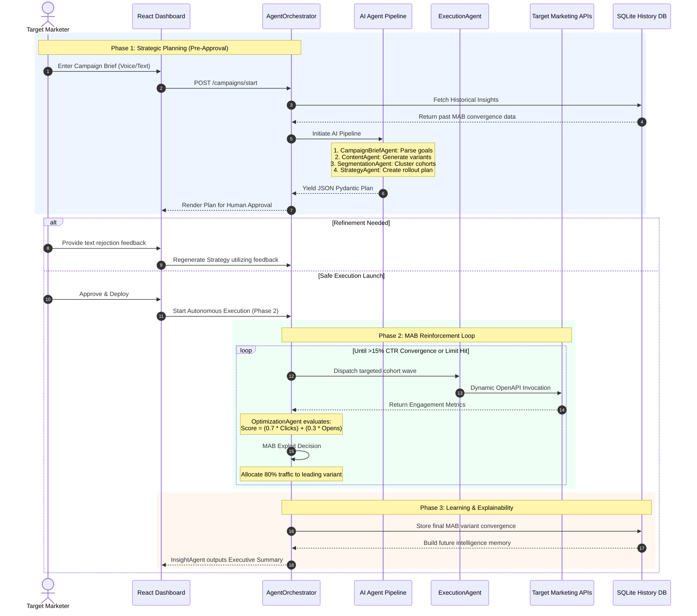

# CampaignX - FrostHack Case Competition Pitch Deck (Preliminary Phase)

*Note: This presentation strictly adheres to the 5-content-slide maximum. The presentation is organized explicitly around the 5 core judging criteria pillars.*

---

<section id="cover-slide">

## Slide 1: Cover

*   **Title:** CampaignX
*   **Subtitle:** Fully Autonomous AI Agent System for Marketing Cycle Automation
*   **Core Pillars:** Explainability · Dynamic OpenAPI Safety · Mathematical Reinforcement Learning
*   **Team:** [Your Team Name]
*   **Slide Footer:** *InXiteOut FrostHack 2026 - Track: Agentic AI for SuperBFSI*

</section>

---

<section id="problem">

## Slide 2: Problem

**The Challenge with Current Marketing Automation:**

*   **"Black Box" Fragility:** Standard AI lacks true autonomy. It relies on brittle prompt chains that hallucinate data and cannot explain their semantic decisions.
*   **Infrastructure Danger:** Blind API execution rapidly exhausts rate limits, predictably crashing production systems.
*   **The A/B Testing Flaw:** Traditional A/B testing is mathematically inefficient—wasting exactly 50% of your valuable customer traffic on losing variations before ever realizing it's failing. 

*   **Slide Footer:** *Rate Limit Crashes. Unstructured Execution. Expensive ROI Waste.*

</section>

---

<section id="solution">

## Slide 3: Solution

**Pydantic Agents & Autonomous Optimization:**
CampaignX replaces simple chatbots with deterministic, enterprise-grade software engineered specifically for the SuperBFSI ecosystem.

*   **Strict Enterprise Rigor:** 8 distinct, specialized AI agents output perfectly typed Pydantic JSON to eliminate all hallucination.
*   **Voice-Activated Planning:** Marketers bypass typing entirely by dictating complex campaign goals directly into the browser Voice UI.
*   **O(N) Algorithmic Scaling:** Instead of crashing LLM token limits, our hybrid LLM/Python engine cross-references 100k+ customer cohorts locally in instant `O(N)` time.
*   **Dynamic OpenAPI Discovery:** Zero hardcoded API URLs. Our custom `OpenAPILoader` dynamically discovers and validates SuperBFSI endpoints safely before execution.

*   **Slide Footer:** *Robust Software Engineering. Zero "Chatbot" Spaghetti Code. Meticulously Scaled.*

</section>

---

<section id="architecture">

## Slide 4: Architecture

**Key Highlights:** 8 Modular Agents | Dedicated Safety Tracker | Dual LLM Routing (Groq Llama 3.3 for Reasoning, Meta Llama 3 for Math)

```mermaid
graph TD

    %% Styles
    classDef ui fill:#10b981,color:#fff,rx:8px,ry:8px,stroke:#059669,stroke-width:2px;
    classDef orchestration fill:#6366f1,color:#fff,rx:8px,ry:8px,stroke:#4f46e5,stroke-width:2px;
    classDef agent fill:#8b5cf6,color:#fff,rx:8px,ry:8px,stroke:#7c3aed,stroke-width:2px;
    classDef infra fill:#f59e0b,color:#fff,rx:8px,ry:8px,stroke:#d97706,stroke-width:2px;
    classDef memory fill:#ec4899,color:#fff,rx:8px,ry:8px,stroke:#be185d,stroke-width:2px;
    classDef ai fill:#475569,color:#fff,rx:8px,ry:8px,stroke:#334155,stroke-width:2px;

    %% UI Layer
    subgraph UI_Layer["User Interface Layer"]
        UI[React Campaign Dashboard<br/><i>Vite + Tailwind</i>]:::ui
    end

    %% Orchestration Layer
    subgraph Orchestration_Layer["AI Orchestration Layer"]
        ORCH{Agent Orchestrator<br/><i>FastAPI + Async Control</i>}:::orchestration
    end

    %% Agent Intelligence Layer
    subgraph Agent_Layer["Autonomous Agent Intelligence"]
        direction TB
        A1[1. CampaignBriefAgent<br/><i>Generates BriefOutputSchema</i>]:::agent
        A2[2. ContentAgent<br/><i>Generates ContentVariantsSchema</i>]:::agent
        A3[3. SegmentationAgent<br/><i>LLM Rules + O(N) Scale</i>]:::agent
        A4[4. StrategyAgent<br/><i>A/B Temporal Planning</i>]:::agent
        A5[5. ExecutionAgent<br/><i>HTTP Client</i>]:::agent
        A6[6. AnalyticsAgent<br/><i>Metric Aggregation</i>]:::agent
        A7[7. OptimizationAgent<br/><i>Multi-Armed Bandit</i>]:::agent
        A8[8. InsightAgent<br/><i>Explainable AI Translator</i>]:::agent
    end

    %% Infrastructure Layer
    subgraph Infra_Layer["Execution Infrastructure"]
        RT[RateTracker<br/><i>API Safety Guard</i>]:::infra
        TR[OpenAPI Tool Registry<br/><i>Dynamic API Discovery</i>]:::infra
        API[SuperBFSI Target APIs]:::infra
    end

    %% Memory Layer
    subgraph Memory_Layer["Learning & Memory"]
        DB[(Campaign History DB<br/><i>SQLite</i>)]:::memory
        HLS[Historical Learning Service]:::memory
    end

    %% AI Engines
    subgraph AI_Layer["LLM Intelligence"]
        LLM1[Groq Llama 3.3 70B<br/><i>Cognitive Reasoning</i>]:::ai
        LLM2[Meta Llama 3<br/><i>Math Optimization</i>]:::ai
    end

    %% Core Flow
    UI -->|HTTP POST| ORCH
    ORCH -->|Async Dispatch| A1
    A1 -->|Valid JSON| A2
    A2 -->|Valid JSON| A3
    A3 -->|Segment IDs| A4
    A4 -.->|Human Approval Gate| A5
    A5 -->|Target Mappings| A6
    A6 -->|Click/Open Ratios| A7
    A7 -->|Variant Updates| A8

    %% Execution connections
    A5 -->|Intercepts Limit| RT
    RT -->|Passes request| TR
    TR -->|REST HTTP| API

    %% Learning connections
    A8 -.->|Stores Data| DB
    DB -.->|Injects Prior Knowledge| HLS
    HLS -.->|Appends System Prompt| A1

    %% AI Integrations
    A1 -.-> LLM1
    A7 -.-> LLM2
```

*   **Slide Footer:** *O(N) Complexity Scaling. Modular 8-Agent Pydantic Guards. Autonomous Tool Safety.*

</section>

---

<section id="workflow">

## Slide 5: Workflow

**Key Highlights:** Strict safety UI gate separates strategic generation (Phase 1) from autonomous api payloads (Phase 2), satisfying Rule 6.5. 



*   **Slide Footer:** *Phase 1 Safety Gates. Phase 2 Autonomous Discovery. Phase 3 Explainable Memory.*

</section>

---

<section id="optimization-engine">

## Slide 6: Optimization

**Key Highlights:** Ruthlessly optimizing conversion by halting A/B tests early. Eradicating wasted execution traffic on losing variations structurally.

**How CampaignX Maximizes Evaluation Score:**
*   **The Math:** Driven strictly by the hackathon formula -> `(0.7 × Clicks) + (0.3 × Opens)`
*   **The Fast Exploit:** Once the Reinforcement Loop isolates a winning semantic structure with >15% superiority, 80% of all subsequent campaign traffic is systematically routed instantly to that victor.
*   **Explainable Traceability:** All metric decisions are translated natively back into plain-English via the React UI, solving the AI "Black Box" problem.

```mermaid
flowchart TD
    classDef math fill:#8b5cf6,color:#fff,rx:8px,ry:8px,stroke:#5b21b6,stroke-width:2px;
    classDef decision fill:#ec4899,color:#fff,rx:8px,ry:8px,stroke:#be185d,stroke-width:2px;
    classDef stack fill:#10b981,color:#fff,rx:8px,ry:8px,stroke:#059669,stroke-width:2px;

    subgraph "Phase 2: Reinforcement Learning (MAB) Engine"
        Metrics[Fetch Real-Time<br>API Engagement Metrics] --> Calc[Apply Rulebook Math Formula<br/><b>Score = (0.7 * Clicks) + (0.3 * Opens)</b>]:::math
        Calc --> Decision{Clear Winner<br>Identified?}:::decision
        
        Decision -- Yes (Exploit) --> Route[<b>Exploit:</b> Route 80% Future Traffic<br/>Mass-allocate variant execution]
        Decision -- No (Explore) --> Mutate[<b>Explore:</b> LLM Mutates Losing Variants<br/>Test Tone, Emoji, Urgency on 20%]
        
        Route --> Next[Continue Loop over Cohort Waves]
        Mutate --> Next
    end
    
    subgraph "CampaignX Enterprise Stack"
        FE[<b>Frontend Dashboard</b><br/>React 18 + Vite]:::stack
        BE[<b>AI Orchestrator</b><br/>FastAPI Async App]:::stack
        Val[<b>Data Integrity</b><br/>Pydantic Generative JSON]:::stack
        Mem[<b>Memory State</b><br/>SQLite History DB]:::stack
    end
```

*   **Slide Footer:** *Ruthless 70/30 MAB Execution. Eradicating A/B Waste. Visually Mapped in Real-Time.*

</section>

---

<section id="demo-conclusion">

## Slide 7: Demonstration

**We are now ready to demonstrate CampaignX for the Preliminary Phase.**
*   Live Multi-Armed Bandit runtime visualization
*   Resilient API rate limit tracking and simulated HTTP execution
*   Real-time Voice-to-Text dynamic dashboard planning

*Note: As per Section 8.1, the full automated optimization loop video recording will be provided during the Test Phase Final Submission.*

*   **Repositories / Contact:** [Insert Links]
*   **Slide Footer:** *InXiteOut FrostHack 2026 - Engineered for Scale.*

</section>
